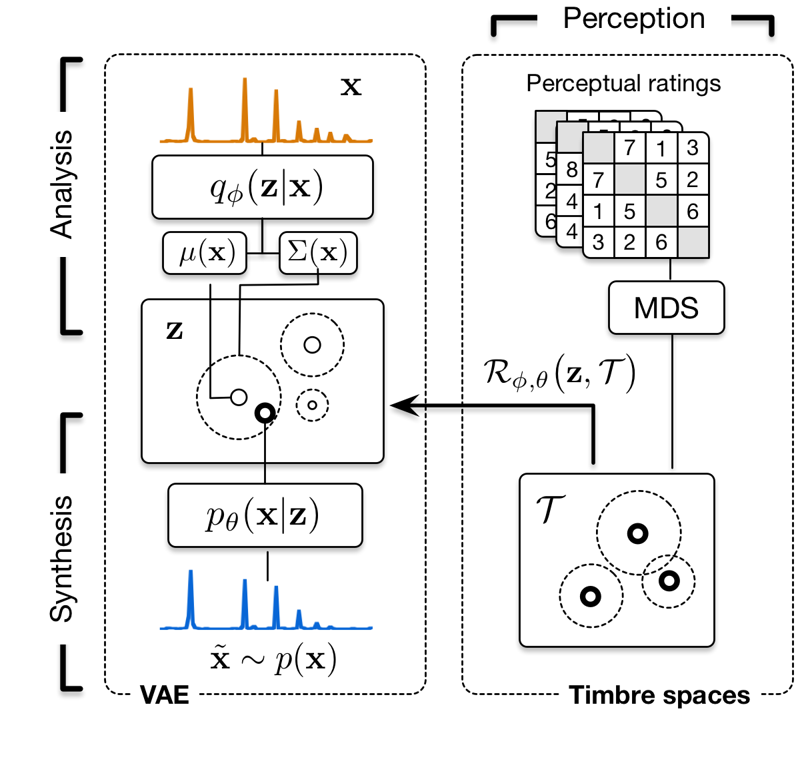

<!--

-->

 

# Universal audio synthesizer control with normalizing flows

This website presents additional material and experiments around the paper *Universal audio synthesizer control with normalizing flows*.

The ubiquity of sound synthesizers has reshaped music production and even entirely defined new music genres. However, the increasing complexity and number of parameters in modern synthesizers make them harder to master. We thus need methods to easily create and explore with synthesizers.

Our paper introduces a radically novel formulation of audio synthesizer control. We formalize it as finding an organized latent audio space that represents the capabilities of a synthesizer, while constructing an invertible mapping to the space of its parameters. By using this formulation, we show that we can address simultaneously *automatic parameter inference, *macro-control learning* and *audio-based preset exploration* within a single model. To solve this new formulation, we rely on Variational Auto-Encoders (VAE) and Normalizing Flows (NF) to organize and map the respective *auditory* and *parameter* spaces. We introduce a new type of NF named *regression flows* that allows to perform an invertible mapping between separate latent spaces, while steering the organization of some of the latent dimensions.

**Contents**
  * [Audio samples](#audio-samples)
  * [Latent space exploration]
  * [Macro-control learning](#macro-control-learning)
  * [Real-time implementation using Ableton Live](#real-time-implementation-using-ableton-live)
  * [Code](#code)

## Audio samples

## Latent space exploration

## Macro-control learning

## Real-time implementation using Ableton Live

## Code

**The full code will only be released upon acceptance of the paper** and will be available on the corresponding [GitHub repository](https://github.com/anonymous124/flow_synthesizer).
