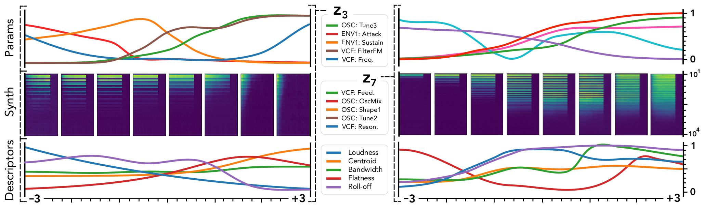
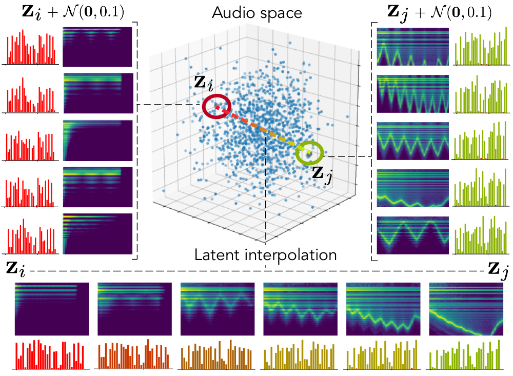

<!--

-->

 

# Universal audio synthesizer control with normalizing flows

**This website is still under construction. We keep adding new results, so please come back later if you want more.**

This website presents additional material and experiments around the paper *Universal audio synthesizer control with normalizing flows*.

The ubiquity of sound synthesizers has reshaped music production and even entirely defined new music genres. However, the increasing complexity and number of parameters in modern synthesizers make them harder to master. We thus need methods to easily create and explore with synthesizers.

Our paper introduces a radically novel formulation of audio synthesizer control. We formalize it as finding an organized latent audio space that represents the capabilities of a synthesizer, while constructing an invertible mapping to the space of its parameters. By using this formulation, we show we can address simultaneously *automatic parameter inference*, *macro-control learning* and *audio-based preset exploration* within a single model. To solve this new formulation, we rely on Variational Auto-Encoders (VAE) and Normalizing Flows (NF) to organize and map the respective *auditory* and *parameter* spaces. We introduce a new type of NF named *regression flows* that allows to perform an invertible mapping between separate latent spaces, while steering the organization of some of the latent dimensions.

**Contents**
  * [Audio reconstruction](#audio-reconstruction)
  * [Macro-control learning](#macro-control-learning)
  * [Audio space interpolation](#audio-space-interpolation)
  * [Vocal sketching](#vocal-sketching)
  * [Real-time implementation using Ableton Live](#real-time-implementation-using-ableton-live)
  * [Code](#code)

## Audio reconstruction

Our first experiment consists in evaluating the reconstruction ability of our model. Reconstruction is done *via* parameter inference, which means an audio sample is embedded in the latent space, then mapped to synth parameters, that are used to synthesize the reconstructed audio. In the examples below, the first sound is a sample drawn from the test set, and the second is its reconstruction by one of the implemented models.

<table>
    <tr>
        <th>Model</th>
        <th>Samples</th>
        <th>Spectrogram</th>
        <th>Parameters</th>
    </tr>
    <tr>
        <td>CNN</td>
        <td>
            <audio controls> 
                <source src="audio/reconstruction/cnn_mel_mse_1_batch_1.mp3">
            </audio>
        </td>
    </tr>
    <tr>
        <td>MLP</td>
        <td>
            <audio controls> 
                <source src="audio/reconstruction/mlp_mel_mse_1_batch_1.mp3">
            </audio>
        </td>
    </tr>
    <tr>
        <td>VAE</td>
        <td>
            <audio controls> 
                <source src="audio/reconstruction/vae_mel_mse_cnn_mlp_1_batch_1.mp3">
            </audio>
        </td>
    </tr>
    <tr>
        <td>WAE</td>
        <td>
            <audio controls> 
                <source src="audio/reconstruction/wae_mel_mse_cnn_mlp_1_batch_1.mp3">
            </audio>
        </td>
    </tr>
    <tr>
        <td>VAE-Flow</td>
        <td>
            <audio controls> 
                <source src="audio/reconstruction/vae_flow_mel_mse_cnn_mlp_iaf_1_batch_1.mp3">
            </audio>
        </td>
    </tr>
    <tr>
        <td>VAE-Flow-post</td>
        <td>
            <audio controls> 
                <source src="audio/reconstruction/vae_flow_mel_mse_cnn_flow_kl_f_iaf_1_batch_1.mp3">
            </audio>
        </td>
    </tr>
</table>

## Macro-control learning

The latent dimensions can be seen as meta-parameters for the synthesizer that naturally arise from our framework. Moreover, as they act in the latent audio space, one could hope they impact audio features in a smoother way than native parameters.

The following figure presents the evolution of synth parameters and corresponding spectrogram while moving along two dimensions of the latent space ($$z_3$$ and $$z_7$$). The spectrograms show a smooth variation in audio features, while parameters move in a clearly non-independent and less smooth fashion. This proves latent dimensions rather encode audio features than simply parameters values.

## Audio space interpolation

In this experiment, we select two audio samples, embed them in the latent space, and continuously interpolate in between. At each interpolated latent point, we are able to output the corresponding synthesizer parameters and thus to synthesize audio.

From the figure below, one can also visualize the way spectograms and parameters evolve in the neighborhoods of the two latent points. It is encouraging to see how the spectrograms look alike, even though parameters may vary more.

Below are the two audio samples, drawn from the test set:

<audio controls> 
    <source src="audio/interpolation/.mp3">
</audio>

<audio controls> 
    <source src="audio/interpolation/p1.mp3">
</audio>

And below, the interpolations output by the different models (TODO):

<table>
    <tr>
        <th>Model</th>
        <th>Samples</th>
    </tr>
    <tr>
        <td>CNN</td>
        <td>
            <audio controls> 
                <source src="audio/interpolation/.mp3">
            </audio>
        </td>
    </tr>
    <tr>
        <td>MLP</td>
        <td>
            <audio controls> 
                <source src="audio/interpolation/.mp3">
            </audio>
        </td>
    </tr>
    <tr>
        <td>VAE</td>
        <td>
            <audio controls> 
                <source src="audio/interpolation/.mp3">
            </audio>
        </td>
    </tr>
    <tr>
        <td>WAE</td>
        <td>
            <audio controls> 
                <source src="audio/interpolation/.mp3">
            </audio>
        </td>
    </tr>
    <tr>
        <td>VAE-Flow</td>
        <td>
            <audio controls> 
                <source src="audio/interpolation/.mp3">
            </audio>
        </td>
    </tr>
    <tr>
        <td>VAE-Flow-post</td>
        <td>
            <audio controls> 
                <source src="audio/interpolation/.mp3">
            </audio>
        </td>
    </tr>
</table>

## Vocal sketching

Finally, our models allow vocal sketching, by embedding a recorded vocal sample in the latent space and finding the matching parameters. Below are examples of how the models respond to several recorded samples.

## Real-time implementation using Ableton Live

Not available yet.

## Code

The full code will only be released after the end of the review process and will be available on the corresponding [GitHub repository](https://github.com/anonymous124/flow_synthesizer).

